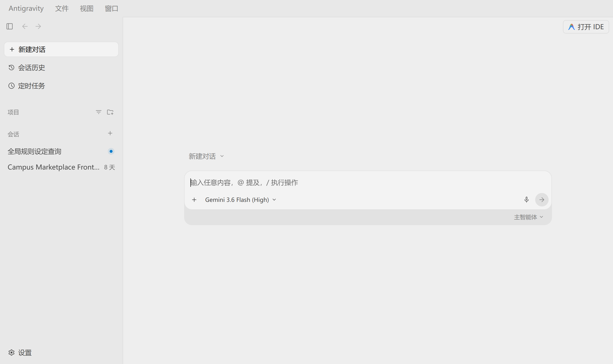

# Antigravity Desktop 中文汉化插件

<p align="center">
  <a href="LICENSE"></a>
  
  
</p>

<p align="center">
  
</p>

> 面向 **Antigravity Desktop 2.4.3+** 的深度中文汉化方案，支持 Windows / macOS / Linux，覆盖设置中心、侧边栏、对话交互、模型选择、`/` 命令菜单、托盘与系统对话框等全部可见 UI。
>
> ⚠️ 非官方项目，仅做界面文案翻译，不涉及账户、计费或功能逻辑。修改 `app.asar` 可能违反官方服务条款，请自行评估风险。

## 特性

- **约 460+ 词条**全界面汉化，动态文案（配额、Token、会话数等）由正则模式实时翻译
- **智能保留**：模型名、主题品牌名、套餐名、技能标识、URL、快捷键键名保持原文
- **自动备份 + 版本校验**：应用更新后重跑安装即自动适配，卸载一键还原官方原版
- **写入前完整性自检**：打包后校验 asar 结构、文件数与数据边界，避免损坏应用
- 对免费 / Pro / Ultra 订阅全部通用

## 快速开始

```bash
git clone https://github.com/Sj295/antigravity-chinese-plugin.git
cd antigravity-chinese-plugin
```

| 系统 | 安装 | 卸载 |
|---|---|---|
| Windows | `install.bat` | `uninstall.bat` |
| macOS / Linux | `./install.sh` | `./uninstall.sh` |

任意平台也可直接使用命令（自动关闭正在运行的应用）：

```bash
node scripts/patch.js install     # 安装
node scripts/patch.js uninstall   # 卸载
node scripts/patch.js verify      # 状态检查
```

## 环境要求

- Node.js v14+（https://nodejs.org）
- Antigravity Desktop 2.4.3 及以上版本

安装目录非标准位置时，用环境变量指定：`ANTIGRAVITY_RESOURCES_DIR=/path/to/resources`

## 常见问题

**应用更新后汉化失效？** 重新运行安装脚本即可（版本校验会自动刷新备份）。

**部分界面仍是英文？** 新版本可能新增词库未覆盖的文案，欢迎在 [Issues](https://github.com/Sj295/antigravity-chinese-plugin/issues) 反馈。

**如何贡献翻译？** 在 `src/injector.js` 的 `I18N.exact` / `I18N.patterns` 中新增词条，同步更新 `src/i18n.js`，运行 `node scripts/check_i18n_sync.js` 校验后提交 PR。

## 许可证

[MIT](LICENSE)
